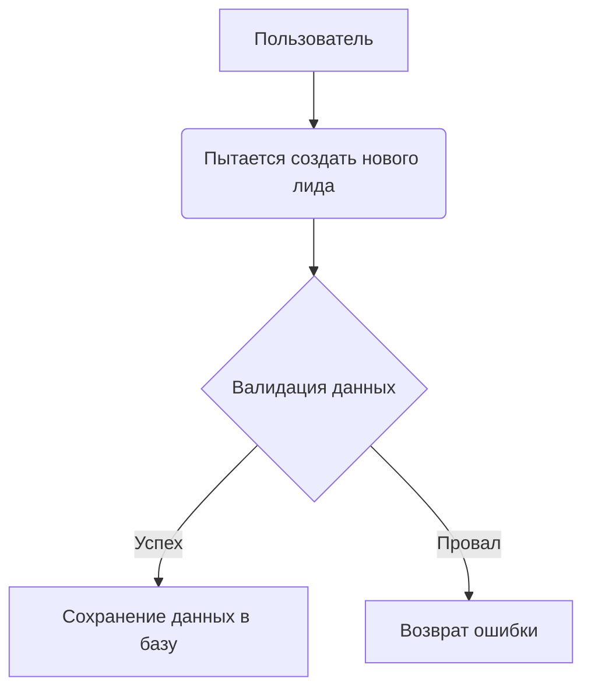

## Название: Создание пользователя
### Актеры:
Пользователь

### Описание:
Пользователь системы должен иметь возможность создавать новых лидов в системе.

### Данные:
Имя, Фамилия, Email

### Предусловия:
Пользователь системы имеет права доступа и аутентификационные данные для входа в систему.

### Основной поток событий:
1. Сервер валидирует входящие данных.
2. Сервер сохраняет данные лида в базе.

### Альтернативные потоки:
- Если данные не прошли валидацию вернуть ошибку.

### Постусловия:
Новый лид успешно создан в системе и сохранен в базе данных.

