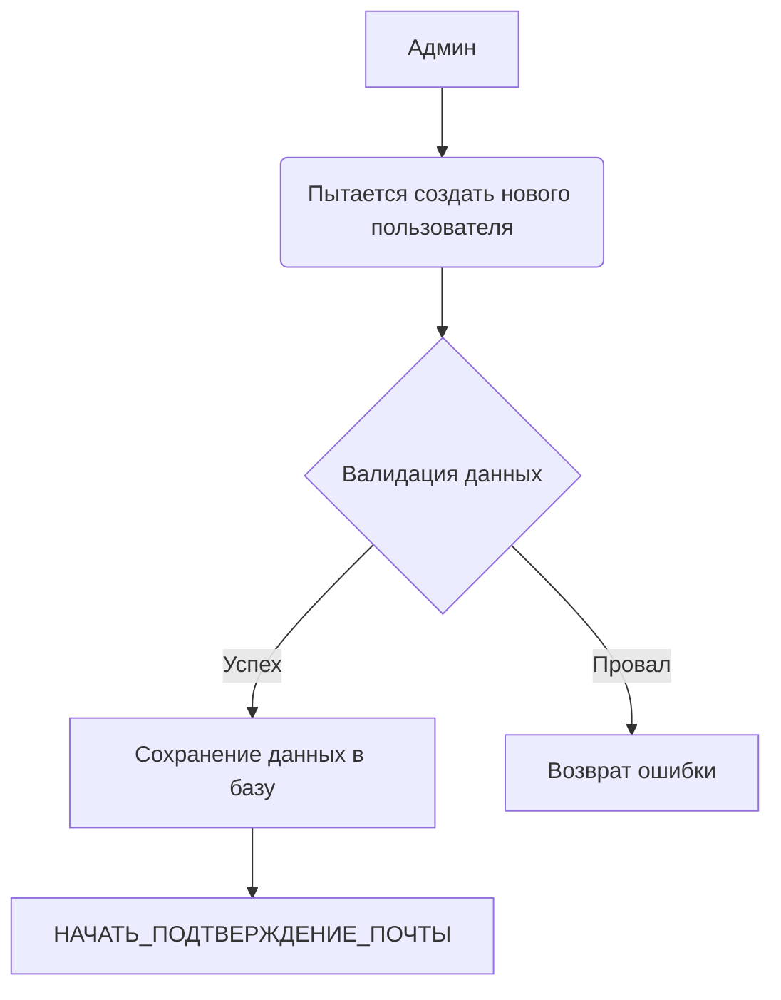

## Название: Создание пользователя
### Актеры:
Администратор системы

### Описание:
Администратор системы должен иметь возможность создавать новых пользователей в системе.

### Данные:
Имя, Фамилия, Email

### Предусловия:
Администратор системы имеет права доступа и аутентификационные данные для входа в систему.

### Основной поток событий:
1. Сервер валидирует входящие данных.
2. Сервер сохраняет данные пользователя в базе.
3. Запуск сценария ПОДТВЕРЖДЕНИЕ_ПОЧТЫ_ПОЛЬЗОВАТЕЛЯ.

### Альтернативные потоки:
- Если данные не прошли валидацию вернуть ошибку.
- Если адрес почты уже существует вернуть ошибку.

### Постусловия:
Новый пользователь успешно создан в системе и сохранен в базе данных.

