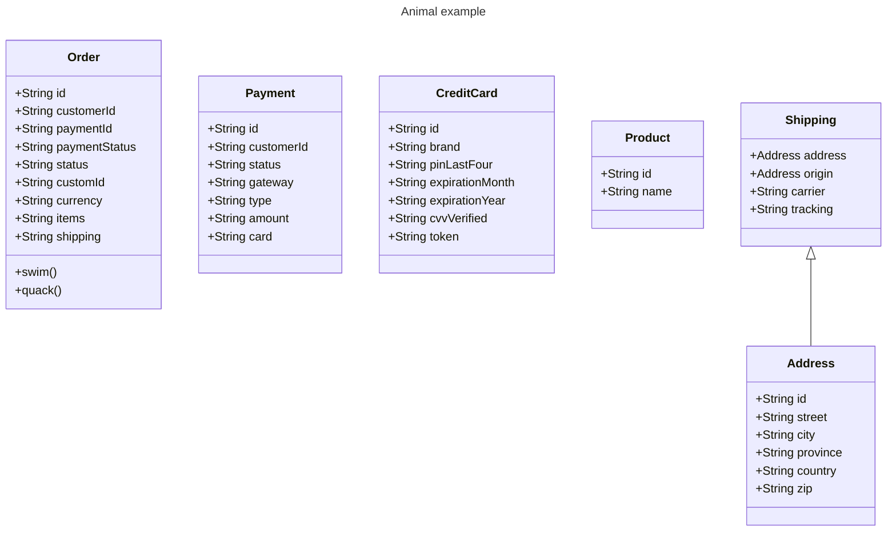

```mermaid
---
title: Animal example
---
classDiagram
class Order{
+String id
+String customerId
+String paymentId
+String paymentStatus
+String status
+String customId
+String currency
+String items
+String shipping
+swim()
+quack()
}
class Payment{
+String id
+String customerId
+String status
+String gateway
+String type
+String amount
+String card
}
class Address{
    +String id
    +String street
    +String city
    +String province
    +String country
    +String zip
}
class CreditCard{
    +String id
    +String brand
    +String pinLastFour
    +String expirationMonth
    +String expirationYear
    +String cvvVerified
    +String token
}
class Product{
    +String id
    +String name
}
class Shipping{
    +Address address
    +Address origin
    +String carrier
    +String tracking
}
    Shipping <|-- Address

```